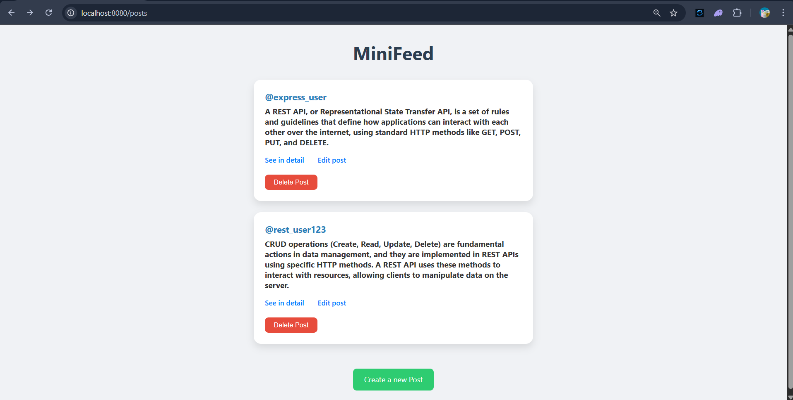
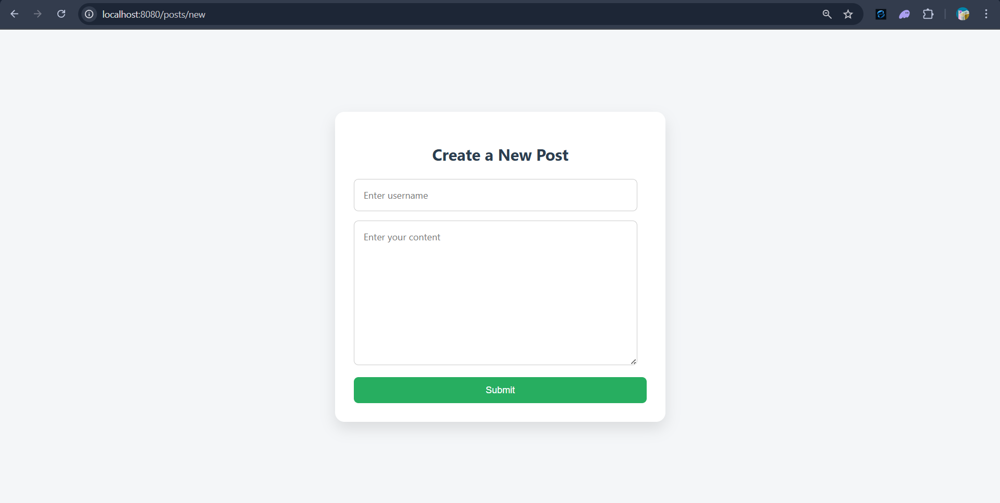
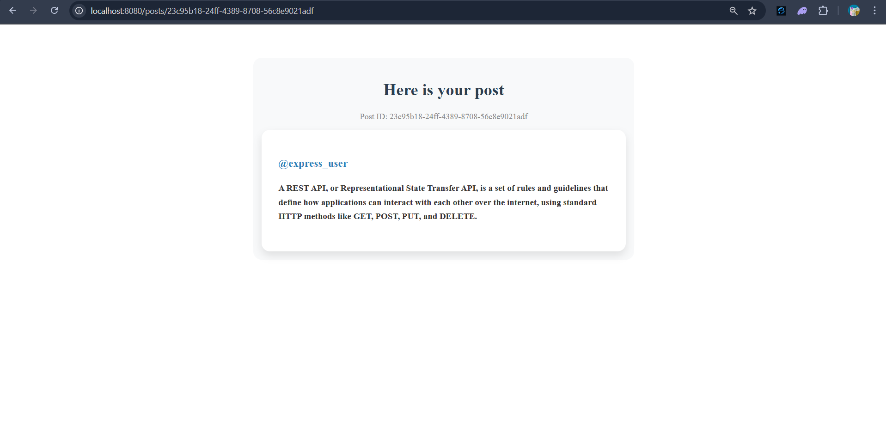
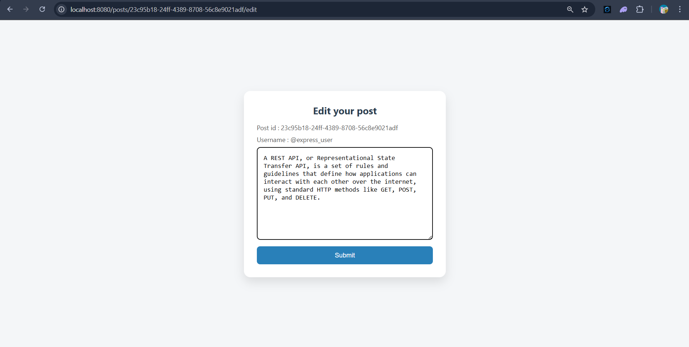

# MiniFeed 📝

A simple web app built using **Node.js**, **Express**, and **EJS** that demonstrates core **CRUD operations** through a RESTful interface. MiniFeed allows users to create, read, update, and delete text posts — similar to a minimalist version of Quora or a microblogging platform.

---

## 🚀 Features

- ✅ Create new posts with a username and content  
- 📄 View individual post details  
- 📝 Edit previously created posts  
- ❌ Delete posts from the feed  
- 🌐 RESTful routing using Express  
- 💅 Simple, clean UI using EJS and CSS

---

## 🧱 Tech Stack

- [Node.js](https://nodejs.org/)
- [Express](https://expressjs.com/)
- [EJS](https://ejs.co/)
- HTML/CSS (Vanilla)

---

## 📸 Screenshots

### 🏠 Homepage (`/posts`)


### 🆕 Create New Post (`/posts/new`)


### 📄 View a Post (`/posts/:id`)


### ✏️ Edit Post (`/posts/:id/edit`)


---

## 🛠️ Getting Started

### 1. Clone the repository

```bash
git clone https://github.com/amit-kr-yash/MiniFeed-CRUD-opaertions.git

